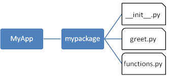
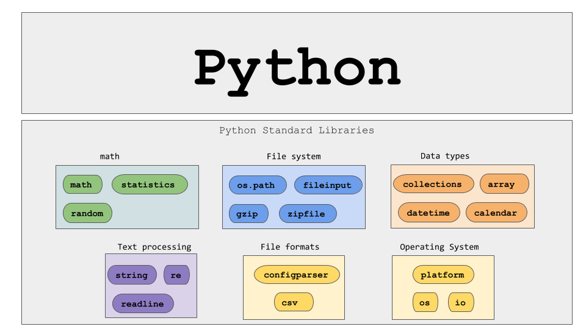
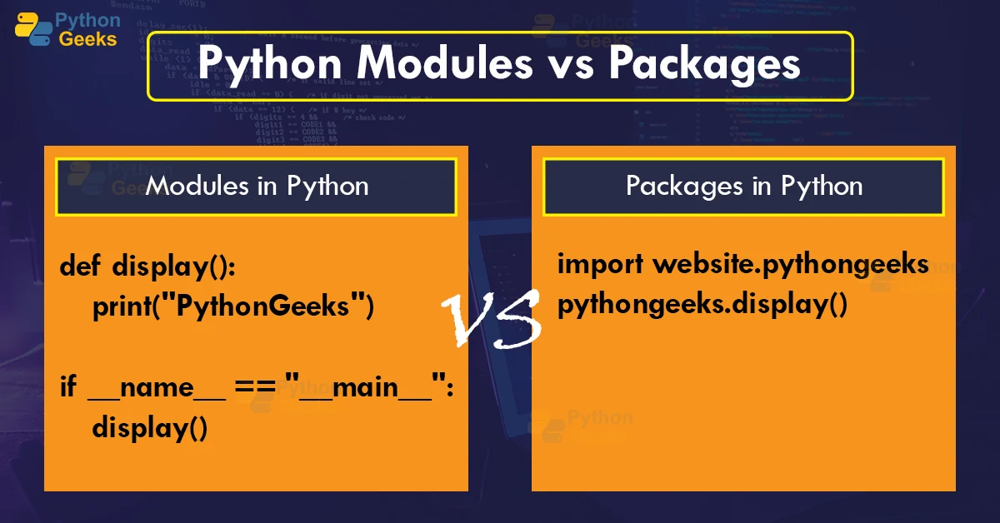

# tech201_packages_and_libraries
tech201_packages_and_libraries

Packages and libraries in Python

A package in Python is a way to organize modules, which are Python files with definitions and statements, into a directory hierarchy. Packages allow for a namespace and can be organized to help prevent naming collisions between modules. Packages can contain sub-packages, which themselves can contain modules, and so on. To use a module in a package, one imports the module using the dot (.) syntax. For example, if a package "mypackage" contains a module "mymodule", one can import it with "import mypackage.mymodule".

You can import packages using the following:
`import math`

There are many packages one can import

### Libraries in Python

- A Python library is a collection of related modules. It contains bundles of code that can be used repeatedly in different programs. It makes Python Programming simpler and convenient for the programmer. As we don’t need to write the same code again and again for different programs. Python libraries play a very vital role in fields of Machine Learning, Data Science, Data Visualization, etc.

These are some standar libraries below.

### What is Python Module 
- A Python module is a file containing Python definitions and statements. A module can define functions, classes, and variables. A module can also include runnable code. Grouping related code into a module makes the code easier to understand and use. It also makes the code logically organized.

- A simple module, calc.py, whuch has 2 functions one add and another subtract.

`def add(x, y):
    return (x+y)`

`def subtract(x, y):
	return (x-y)`

This image below also shows some of the differences between Modules and Packages.

- The main difference between a module and a package in Python is that a module is a simple Python script with a .py extension file that contains collections of functions and global variables. In contrast, a package is a directory that contains a collection of modules, and this directory also contains an __init__.py file by which the interpreter interprets it as a package.