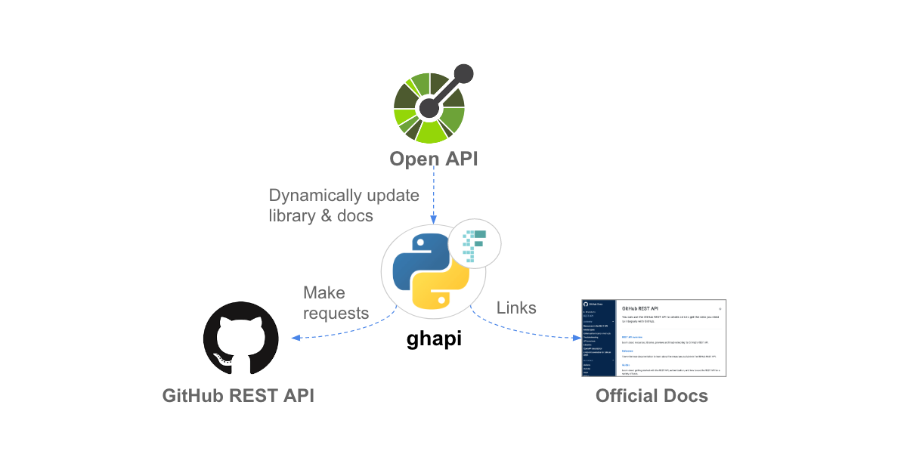
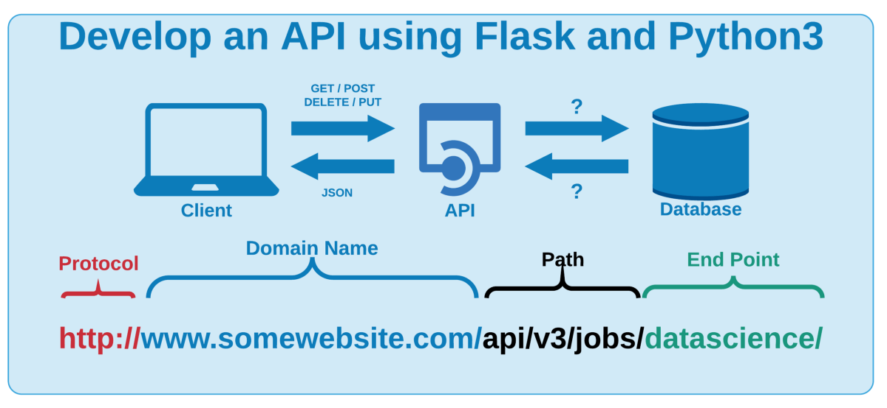

## Python API
#####  Application Programming Interface
##### How Software can communicate with one another.

- In Python, an API can be implemented using a web framework such as Flask or Django. These frameworks allow you to create endpoints that can be accessed by external clients, such as a web or mobile application. Each endpoint can correspond to a specific resource or function in your application and can accept request parameters and return data in a specified format, such as JSON.

These above images illustrate the use of API very well.